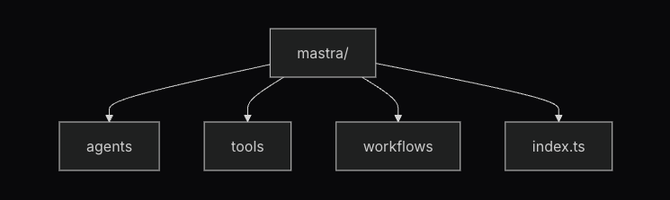

# Mastra Starter Template


Build AI-powered applications with the Mastra framework. Everything you need to quickly develop and deploy AI agents and workflows.

[Mastra AI](https://mastra.ai) is a powerful framework for building AI applications with agents, tools, and workflows. This starter kit demonstrates how to:

- Create AI agents using LLMs
- Build custom tools for your agents
- Define multi-step workflows
- Set up a development environment

---

# Starter Kit Overview

## Project Structure


```
mastra-starter/
├── src/
│   └── mastra/
│       ├── agents/           # AI agent definitions
│       ├── tools/            # Custom tools for agents
│       ├── workflows/        # Multi-step workflows
│       └── index.ts          # Main Mastra configuration
├── package.json              # Project dependencies
├── tsconfig.json             # TypeScript configuration
└── .env.example              # Environment variables template
```

## Features

- **Pre-configured Agents**: Agents powered by OpenAI models
- **Custom Tools**: Ready-to-use tools for common tasks like weather data retrieval
- **Workflow System**: Define complex multi-step processes with error handling
- **TypeScript Support**: Full type safety with TypeScript
- **Development Server**: Built-in development server with hot reloading
- **Dashboard**: Interactive interface for testing and debugging.

## Benefits

**Quick Start**: Get up and running with minimal setup.

**Best Practices**: Learn from pre-built examples following best practices.

**Extensible**: Easily add new agents, tools, and workflows.

**Modern Tech Stack**: Built with TypeScript, OpenAI, and modern JavaScript.

**Production Ready**: Structured for both development and production deployment.

## Requirements

- Node.js 22+ (LTS recommended)
- npm or yarn
- OpenAI API key (for the example agent)

## Getting Started

1. Clone the repository:
   ```bash
   git clone https://github.com/BunsDev/mastra-starter.git
   cd mastra-starter
   ```

2. Set up environment variables:
   ```bash
   cp .env.example .env && OPENAI_API_KEY=your_api_key_here
   ```

3. Install dependencies and start development server:
   ```bash
   yarn && yarn dev
   ```

## Development Mode

Running `yarn dev` or `npm run dev` starts the Mastra development server, which:

- Watches for changes in your source files
- Automatically restarts the server when changes are detected
- Provides a dashboard interface to interact with your agents and workflows
- Logs detailed information about agent interactions and workflow executions

## Mastra Dashboard

Running the development server, opens a local development dashboard at [`http://localhost:4111`](http://localhost:4111). This dashboard provides:

- A chat interface to interact with your agents
- Workflow execution visualization
- Debug information and logs
- Agent and tool performance metrics
- Direct access to workflow execution details

## Mastra API

[`/api`](http://localhost:4111/api) provides endpoints for:

- Starting workflow executions
- Sending messages to agents
- Checking workflow status
- Retrieving execution results

### Example API Usage

```typescript
// Start a weather workflow
fetch('http://localhost:4111/api/workflows/weather-workflow/execute', {
  method: 'POST',
  headers: {
    'Content-Type': 'application/json',
  },
  body: JSON.stringify({
    city: 'New York',
  }),
})
  .then(response => response.json())
  .then(data => console.log(data));
```

## Mastra Components
### Agents, Tools, and Workflows

#### [`/agents`](/src/mastra/agents/)


#### [`/tools`](/src/mastra/tools/)


#### [`/workflows`](/src/mastra/workflows/)


## Path to Building AI Applications

- Check out the [Mastra Documentation](https://mastra.ai/docs) for comprehensive guides
- Explore the Weather agent and workflow as examples.
- Experiment with different OpenAI models.
- Create your own custom tools and agents.


___

<div style="display: flex; flex-direction: column; justify-content: center; align-items: stretch; background-color: #000000; padding: 15px; margin: 0 auto; width: 100%; max-width: 800px; border-radius: 8px; border-color: #FFAEE0; border-style: solid;">

<div style="display: flex; justify-content: center; align-items: center; text-align: center; font-size: 24px; height: 60px; margin-bottom: 15px; border-radius: 5px; border-color: #FFAEE0; border-style: solid; color: #FFAEE0; width: 100%; cursor: pointer;" onmouseover="this.style.backgroundColor='#FFAEE0'; this.style.color='#000000';" onmouseout="this.style.backgroundColor='#000000'; this.style.color='#FFAEE0';">
  DeDevs Online Community
</div>

<div style="border: 1.5px; border-color: #FFAEE0; border-style: dotted; margin-bottom: 12px; width: 100%; display: flex; justify-content: center; align-items: center;">
</div>

<div style="display: flex; flex-direction: row; justify-content: center; align-items: stretch; background-color: #000000; padding: 10px; margin-bottom: 15px; border-radius: 5px;">
  <div style="width: 25%; display: flex; justify-content: center; align-items: center; min-height: 120px; background-color: #FFAEE0; border-radius: 5px; padding: 10px;">
    <em style="font-weight: bold; font-size: 18px; color: #000000;">What?</em>
  </div>
  <div style="width: 75%; display: flex; justify-content: center; align-items: center; min-height: 120px; background-color: #000000; padding-left: 15px;">
    <ul style="list-style-type: none; padding-left: 0; width: 100%;">
      <li style="margin-bottom: 8px;">• <strong style="color: #FFAEE0"><a href="https://dedevs.club" style="color: #FFAEE0; text-decoration: none;">Community</a></strong> for Blockchain and AI enthusiasts</li>
      <li style="margin-bottom: 8px;">• <strong style="color: #FFAEE0"><a href="https://blog.dedevs.club" style="color: #FFAEE0; text-decoration: none;">Learning Hub</a></strong> with tutorials, guides, and coding resources</li>
      <li style="margin-bottom: 8px;">• <strong style="color: #FFAEE0"><a href="https://github.com/dedevsclub" style="color: #FFAEE0; text-decoration: none;">Build in Public</a></strong> with our developer community</li>
      <li>• <strong style="color: #FFAEE0"><a href="https://whop.com/dedevs" style="color: #FFAEE0; text-decoration: none;">Join Us</a></strong> and be part of the movement</li>
    </ul>
  </div>
</div>

<div style="display: flex; flex-direction: row; justify-content: center; align-items: stretch; background-color: #000000; padding: 10px; margin-bottom: 15px; border-radius: 5px;">
  <div style="width: 25%; display: flex; justify-content: center; align-items: center; min-height: 120px; background-color: #FFAEE0; border-radius: 5px; padding: 10px;">
    <em style="font-weight: bold; font-size: 18px; color: #000000;">Who?</em>
  </div>
  <div style="width: 75%; display: flex; justify-content: center; align-items: center; min-height: 120px; background-color: #000000; padding-left: 15px;">
    <ul style="list-style-type: none; padding-left: 0; width: 100%;">
      <li style="margin-bottom: 8px;">• <strong style="color: #FFAEE0"><a href="https://dedevs.club" style="color: #FFAEE0; text-decoration: none;">Innovators</a></strong> collaborate on cutting-edge projects</li>
      <li style="margin-bottom: 8px;">• <strong style="color: #FFAEE0"><a href="https://dedevs.club" style="color: #FFAEE0; text-decoration: none;">Experts</a></strong> share valuable insights and resources</li>
      <li style="margin-bottom: 8px;">• <strong style="color: #FFAEE0"><a href="https://dedevs.club" style="color: #FFAEE0; text-decoration: none;">Newcomers</a></strong> grow through mentorship and hands-on experience</li>
      <li>• <strong style="color: #FFAEE0"><a href="https://dedevs.club" style="color: #FFAEE0; text-decoration: none;">Communities</a></strong> form around shared technological interests</li>
    </ul>
  </div>
</div>

<div style="display: flex; flex-direction: row; justify-content: center; align-items: stretch; background-color: #000000; padding: 10px; margin-bottom: 15px; border-radius: 5px;">
  <div style="width: 25%; display: flex; justify-content: center; align-items: center; min-height: 120px; background-color: #FFAEE0; border-radius: 5px; padding: 10px;">
    <em style="font-weight: bold; font-size: 18px; color: #000000;">Why?</em>
  </div>
  <div style="width: 75%; display: flex; justify-content: center; align-items: center; min-height: 120px; background-color: #000000; padding-left: 15px;">
    <ul style="list-style-type: none; padding-left: 0; width: 100%;">
      <li style="margin-bottom: 8px;">• <strong style="color: #FFAEE0"><a href="https://dedevs.club" style="color: #FFAEE0; text-decoration: none;">Learning Resources</a></strong> for blockchain and AI development</li>
      <li style="margin-bottom: 8px;">• <strong style="color: #FFAEE0"><a href="https://dedevs.club" style="color: #FFAEE0; text-decoration: none;">Collaborative Projects</a></strong> to gain real-world experience</li>
      <li style="margin-bottom: 8px;">• <strong style="color: #FFAEE0"><a href="https://dedevs.club" style="color: #FFAEE0; text-decoration: none;">Networking Events</a></strong> connecting developers with industry leaders</li>
      <li>• <strong style="color: #FFAEE0"><a href="https://dedevs.club" style="color: #FFAEE0; text-decoration: none;">Technical Workshops</a></strong> on cutting-edge technologies</li>
    </ul>
  </div>
</div>

<div style="border: 1.5px; border-color: #FFAEE0; border-style: dotted; margin-bottom: 12px; width: 100%; display: flex; justify-content: center; align-items: center;">
</div>

<a href="https://dedevs.club" target="_blank" rel="noopener noreferrer" style="display: flex; justify-content: center; align-items: center; margin: 0 auto; width: 100%;">
  <button style="background-color: #FFAEE0; font-size: 16px; font-weight: bold; border-color: #FFAEE0; border-radius: 5px; border-style: solid; color: #000000; width: 100%; height: 40px; cursor: pointer; justify-content: space-between; align-items: center;" onmouseover="this.style.backgroundColor='#FFAEE0'; this.style.color='#000000';" onmouseout="this.style.backgroundColor='#FFAEE0'; this.style.color='#FFAEE0';">
   Join DeDevs Today &#x279a;
  </button>
</a>

</div>