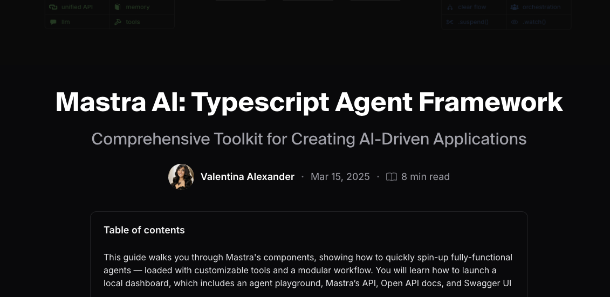

# <div style="display: flex; align-items: center; width: 100%;"><span style="color: #FFAEE0; margin-right: 8px;">🚀</span> Building with Mastra AI</div>

<div style="border: 2px solid #FFAEE0; border-radius: 8px; padding: 15px; margin: 20px 0; background-color: #000000; width: 100%;">
  <p style="color: #ffffff; margin-bottom: 15px; font-size: 16px;">A comprehensive framework for building AI-powered applications with ease. Full article: <a href="https://blog.dedevs.club/mastra-ai-framework" style="color: #FFAEE0; text-decoration: underline;">on Hashnode Blog</a></p>

  <div style="border: 1.5px dotted #FFAEE0; margin-bottom: 12px; width: 100%; display: grid; justify-content: center; align-items: center;">
    
  </div>
</div>

# <div style="display: flex; align-items: center; margin: 20px 0; width: 100%;"><span style="color: #FFAEE0; margin-right: 8px;">🏗️</span> Framework Design</div>

<div style="display: flex; flex-wrap: wrap; gap: 20px; margin: 20px 0; width: 100%;">
  <div style="flex: 1; min-width: 300px; background-color: #000000; border: 2px solid #FFAEE0; border-radius: 8px; padding: 15px; justify-content: center; align-items: center; width: 100%;">
    <ul style="display: grid; grid-template-columns: 1fr; gap: 12px; list-style-type: none; padding: 0 10px; color: #ffffff; margin-top: 20px; width: 100%;">
      <li style="margin-bottom: 12px; text-align: center; transition: transform 0.2s;">
        <a href="/src/mastra/agents" style="display: block; color: #ffffff; text-decoration: none; background-color: rgba(255, 174, 224, 0.1); padding: 12px; border-radius: 6px; border: 1px solid rgba(255, 174, 224, 0.3); transition: all 0.2s ease; width: 100%;">
          <span style="color: #FFAEE0; font-weight: bold; font-size: 16px; display: block; margin-bottom: 5px;">/agents</span>
          <span style="display: block; font-size: 14px;">AI behavior definitions</span>
        </a>
      </li>
      <li style="margin-bottom: 12px; text-align: center; transition: transform 0.2s;">
        <a href="/src/mastra/tools" style="display: block; color: #ffffff; text-decoration: none; background-color: rgba(255, 174, 224, 0.1); padding: 12px; border-radius: 6px; border: 1px solid rgba(255, 174, 224, 0.3); transition: all 0.2s ease; width: 100%;">
          <span style="color: #FFAEE0; font-weight: bold; font-size: 16px; display: block; margin-bottom: 5px;">/tools</span>
          <span style="display: block; font-size: 14px;">Functional extensions</span>
        </a>
      </li>
      <li style="margin-bottom: 12px; text-align: center; transition: transform 0.2s;">
        <a href="/src/mastra/workflows" style="display: block; color: #ffffff; text-decoration: none; background-color: rgba(255, 174, 224, 0.1); padding: 12px; border-radius: 6px; border: 1px solid rgba(255, 174, 224, 0.3); transition: all 0.2s ease; width: 100%;">
          <span style="color: #FFAEE0; font-weight: bold; font-size: 16px; display: block; margin-bottom: 5px;">/workflows</span>
          <span style="display: block; font-size: 14px;">Process orchestration</span>
        </a>
      </li>
    </ul>
  </div>
  <div style="display: flex; justify-content: center; align-items: center; text-align: center; min-width: 300px; border: 1.5px dotted #FFAEE0; background-color: #000000; border-radius: 8px; overflow: hidden; flex: 1; width: 100%;">
    
  </div>
</div>

# <div style="display: flex; align-items: center; width: 100%;"><span style="color: #FFAEE0; margin-right: 8px;">🧩</span> Mastra Components</div>

<div style="display: grid; grid-template-columns: 24fr; gap: 2px; margin: 20px 0; width: 100%;">
  <!-- Agents Card --> 
  <div style="background-color: #000000; border: 2px solid #FFAEE0; border-radius: 8px; padding: 15px; width: 100%;">
    <h2 style="display: flex; align-items: center; color: #FFAEE0; font-weight: bold; font-size: 18px; width: 100%;"><span style="margin-right: 8px;">🤖</span> Agents</h2>
    <ul style="list-style-type: none; padding-left: 0; color: #ffffff; width: 100%;">
      <li style="margin-bottom: 8px;">• <strong>Definition:</strong> AI entities powered by Large Language Models (LLMs)</li>
      <li style="margin-bottom: 8px;">• <strong>Example:</strong> Weather agent showcasing LLM task execution</li>
      <li>• <strong>Implementation:</strong> Structured instructions with model integration</li>
    </ul>
  </div>
  
  <!-- Tools Card -->
  <div style="background-color: #000000; border: 2px solid #FFAEE0; border-radius: 8px; padding: 15px; width: 100%;">
    <h2 style="display: flex; align-items: center; color: #FFAEE0; font-weight: bold; font-size: 18px; width: 100%;"><span style="margin-right: 8px;">🛠️</span> Tools</h2>
    <ul style="list-style-type: none; padding-left: 0; color: #ffffff; width: 100%;">
      <li style="margin-bottom: 8px;">• <strong>Purpose:</strong> Extend agent capabilities for specialized tasks</li>
      <li style="margin-bottom: 8px;">• <strong>Features:</strong> External API integration, data transformation</li>
      <li>• <strong>Example:</strong> Weather tool demonstrating external data fetching</li>
    </ul>
  </div>
  
  <!-- Workflows Card -->
  <div style="background-color: #000000; border: 2px solid #FFAEE0; border-radius: 8px; padding: 15px; width: 100%;">
    <h2 style="display: flex; align-items: center; color: #FFAEE0; font-weight: bold; font-size: 18px; width: 100%;"><span style="margin-right: 8px;">📊</span> Workflows</h2>
    <ul style="list-style-type: none; padding-left: 0; color: #ffffff; width: 100%;">
      <li style="margin-bottom: 8px;">• <strong>Function:</strong> Coordinate agents and tools for complex processes</li>
      <li style="margin-bottom: 8px;">• <strong>Benefits:</strong> Improved code clarity and maintainability</li>
      <li>• <strong>Structure:</strong> Step-based execution with error handling</li>
    </ul>
  </div>
</div>

# <div style="display: flex; align-items: center; width: 100%;"><span style="color: #FFAEE0; margin-right: 8px;">💻</span> Technical Implementation</div>

<div style="display: flex; flex-wrap: wrap; gap: 20px; margin: 20px 0; width: 100%;">
  <!-- TypeScript Card -->
  <div style="background-color: #000000; border: 2px solid #FFAEE0; border-radius: 8px; padding: 15px; flex: 1; min-width: 300px; width: 100%;">
    <h2 style="display: flex; align-items: center; color: #FFAEE0; font-weight: bold; font-size: 18px; width: 100%;"><span style="margin-right: 8px;">📝</span> TypeScript Integration</h2>
    <ul style="list-style-type: none; padding-left: 0; color: #ffffff; width: 100%;">
      <li style="margin-bottom: 8px;">• Strong typing for enhanced developer experience</li>
      <li style="margin-bottom: 8px;">• Error prevention through compile-time checks</li>
      <li>• Comprehensive IDE support</li>
    </ul>
  </div>
  
  <!-- Schema Validation Card -->
  <div style="background-color: #000000; border: 2px solid #FFAEE0; border-radius: 8px; padding: 15px; flex: 1; min-width: 300px; width: 100%;">
    <h2 style="display: flex; align-items: center; color: #FFAEE0; font-weight: bold; font-size: 18px; width: 100%;"><span style="margin-right: 8px;">🔍</span> Schema Validation</h2>
    <ul style="list-style-type: none; padding-left: 0; color: #ffffff; width: 100%;">
      <li style="margin-bottom: 8px;">• <strong>Zod Implementation:</strong> Robust data validation across components</li>
      <li style="margin-bottom: 8px;">• <strong>Benefits:</strong> Runtime type safety and clear error messages</li>
      <li>• <strong>Usage:</strong> Input/output schema definitions for all interactions</li>
    </ul>
  </div>
</div>

## <div style="display: flex; align-items: center; width: 100%;"><span style="color: #FFAEE0; margin-right: 8px;">⚙️</span> Example Workflow</div>

<div style="background-color: #000000; border: 2px solid #FFAEE0; border-radius: 8px; padding: 15px; margin: 20px 0; width: 100%;">

  ```typescript
  const weatherWorkflow = new Workflow({
  name: 'weather-workflow',
  triggerSchema: z.object({
    city: z.string(),
  }),
})
  .step(fetchWeather)
  .then(planActivities);

weatherWorkflow.commit();
```

</div>

# <div style="display: flex; align-items: center; width: 100%;"><span style="color: #FFAEE0; margin-right: 8px;">🚦</span> Getting Started</div>

<div style="display: flex; flex-direction: column; gap: 2px; margin: 20px 0; width: 100%;">
  <!-- Setup Instructions Card -->
  <div style="background-color: #000000; border: 2px solid #FFAEE0; border-radius: 8px; padding: 15px; width: 100%;">
    <h2 style="display: flex; align-items: center; color: #FFAEE0; font-weight: bold; font-size: 18px; width: 100%;"><span style="margin-right: 8px;">📥</span> Setup Instructions</h2>
    <ol style="color: #ffffff; padding-left: 20px; width: 100%;">
      <li style="margin-bottom: 8px;">Clone the repository: <code style="background-color: #111; padding: 2px 5px; border-radius: 3px;">git clone https://github.com/BunsDev/mastra-starter.git</code></li>
      <li style="margin-bottom: 8px;">Set up environment: <code style="background-color: #111; padding: 2px 5px; border-radius: 3px;">cp .env.example .env</code> and add your OpenAI API key</li>
      <li style="margin-bottom: 8px;">Install dependencies: <code style="background-color: #111; padding: 2px 5px; border-radius: 3px;">yarn</code> or <code style="background-color: #111; padding: 2px 5px; border-radius: 3px;">npm install</code></li>
      <li>Start development server: <code style="background-color: #111; padding: 2px 5px; border-radius: 3px;">yarn dev</code> or <code style="background-color: #111; padding: 2px 5px; border-radius: 3px;">npm run dev</code></li>
    </ol>
  </div>
  
  <!-- Dashboard Features Card -->
  <div style="background-color: #000000; border: 2px solid #FFAEE0; border-radius: 8px; padding: 15px; width: 100%;">
    <h2 style="display: flex; align-items: center; color: #FFAEE0; font-weight: bold; font-size: 18px; width: 100%;"><span style="margin-right: 8px;">🖥️</span> Dashboard Features</h2>
    <ul style="list-style-type: none; padding-left: 0; color: #ffffff; width: 100%;">
      <li style="margin-bottom: 8px;">• Interactive chat interface for agent testing</li>
      <li style="margin-bottom: 8px;">• Workflow visualization tools</li>
      <li style="margin-bottom: 8px;">• Comprehensive logs and metrics</li>
      <li>• Playground for experimentation</li>
    </ul>
  </div>
</div>

# <div style="display: flex; align-items: center; width: 100%;"><span style="color: #FFAEE0; margin-right: 8px;">📚</span> Resources</div>

<div style="display: flex; flex-direction: column; gap: 2px; margin: 20px 0; width: 100%;">
  <!-- API Documentation Card -->
  <div style="background-color: #000000; border: 2px solid #FFAEE0; border-radius: 8px; padding: 15px; width: 100%;">
    <h2 style="display: flex; align-items: center; color: #FFAEE0; font-weight: bold; font-size: 18px; width: 100%;"><span style="margin-right: 8px;">🔌</span> API Documentation</h2>
    <ul style="list-style-type: none; padding-left: 0; color: #ffffff; width: 100%;">
      <li style="margin-bottom: 8px;">• Complete endpoints for component interaction</li>
      <li style="margin-bottom: 8px;">• OpenAPI documentation for developers</li>
      <li>• Structured request/response formats</li>
    </ul>
  </div>
  
  <!-- Customization Options Card -->
  <div style="background-color: #000000; border: 2px solid #FFAEE0; border-radius: 8px; padding: 15px; width: 100%;">
    <h2 style="display: flex; align-items: center; color: #FFAEE0; font-weight: bold; font-size: 18px; width: 100%;"><span style="margin-right: 8px;">🔧</span> Customization Options</h2>
    <ul style="list-style-type: none; padding-left: 0; color: #ffffff; width: 100%;">
      <li style="margin-bottom: 8px;">• Create new agents with specialized instructions</li>
      <li style="margin-bottom: 8px;">• Build custom tools for unique functionality</li>
      <li>• Design complex workflows for specific use cases</li>
    </ul>
  </div>

<div style="display: flex; flex-direction: column; justify-content: center; align-items: stretch; background-color: #000000; padding: 15px; margin: 0 auto; width: 100%; border-radius: 8px; border: 2px solid #FFAEE0;">

<div style="display: flex; justify-content: center; align-items: center; text-align: center; font-size: 24px; height: 60px; margin-bottom: 15px; border-radius: 5px; border: 2px solid #FFAEE0; color: #FFAEE0; width: 100%; cursor: pointer;" onmouseover="this.style.backgroundColor='#FFAEE0'; this.style.color='#000000';" onmouseout="this.style.backgroundColor='#000000'; this.style.color='#FFAEE0';">
  DeDevs Online Community
</div>

<div style="border: 1.5px dotted #FFAEE0; margin-bottom: 12px; width: 100%; display: flex; justify-content: center; align-items: center;">
</div>

<div style="display: flex; flex-direction: row; justify-content: center; align-items: stretch; background-color: #000000; padding: 10px; margin-bottom: 15px; border-radius: 5px; width: 100%;">
  <div style="width: 50%; display: flex; justify-content: center; align-items: center; min-height: 120px; background-color: #FFAEE0; border-radius: 5px; padding: 10px;">
    <em style="font-weight: bold; font-size: 18px; color: #000000;">What is DeDevs?</em>
  </div>
  <div style="width: 50%; display: flex; justify-content: center; align-items: center; min-height: 120px; background-color: #000000; padding-left: 15px;">
    <ul style="list-style-type: none; padding-left: 0; width: 100%;">
      <li style="margin-bottom: 8px;">• <strong style="color: #FFAEE0"><a href="https://dedevs.club" style="color: #FFAEE0; text-decoration: none;">Community</a></strong> for Blockchain and AI enthusiasts</li>
      <li style="margin-bottom: 8px;">• <strong style="color: #FFAEE0"><a href="https://blog.dedevs.club" style="color: #FFAEE0; text-decoration: none;">Learning Hub</a></strong> with tutorials, guides, and coding resources</li>
      <li style="margin-bottom: 8px;">• <strong style="color: #FFAEE0"><a href="https://github.com/dedevsclub" style="color: #FFAEE0; text-decoration: none;">Build in Public</a></strong> with our developer community</li>
      <li>• <strong style="color: #FFAEE0"><a href="https://whop.com/dedevs" style="color: #FFAEE0; text-decoration: none;">Join Us</a></strong> and be part of the movement</li>
    </ul>
  </div>
</div>

<div style="display: flex; flex-direction: row; justify-content: center; align-items: stretch; background-color: #000000; padding: 10px; margin-bottom: 15px; border-radius: 5px; width: 100%;">
  <div style="width: 50%; display: flex; justify-content: center; align-items: center; min-height: 120px; background-color: #FFAEE0; border-radius: 5px; padding: 10px;">
    <em style="font-weight: bold; font-size: 18px; color: #000000;">Who should join?</em>
  </div>
  <div style="width: 50%; display: flex; justify-content: center; align-items: center; min-height: 120px; background-color: #000000; padding-left: 15px;">
    <ul style="list-style-type: none; padding-left: 0; width: 100%;">
      <li style="margin-bottom: 8px;">• <strong style="color: #FFAEE0"><a href="https://dedevs.club" style="color: #FFAEE0; text-decoration: none;">Innovators</a></strong> collaborate on cutting-edge projects</li>
      <li style="margin-bottom: 8px;">• <strong style="color: #FFAEE0"><a href="https://dedevs.club" style="color: #FFAEE0; text-decoration: none;">Experts</a></strong> share valuable insights and resources</li>
      <li style="margin-bottom: 8px;">• <strong style="color: #FFAEE0"><a href="https://dedevs.club" style="color: #FFAEE0; text-decoration: none;">Newcomers</a></strong> grow through mentorship and hands-on experience</li>
      <li>• <strong style="color: #FFAEE0"><a href="https://dedevs.club" style="color: #FFAEE0; text-decoration: none;">Communities</a></strong> form around shared technological interests</li>
    </ul>
  </div>
</div>

<div style="display: flex; flex-direction: row; justify-content: center; align-items: stretch; background-color: #000000; padding: 10px; margin-bottom: 15px; border-radius: 5px; width: 100%;">
  <div style="width: 50%; display: flex; justify-content: center; align-items: center; min-height: 120px; background-color: #FFAEE0; border-radius: 5px; padding: 10px;">
    <em style="font-weight: bold; font-size: 18px; color: #000000;">Why join DeDevs?</em>
  </div>
  <div style="width: 50%; display: flex; justify-content: center; align-items: center; min-height: 120px; background-color: #000000; padding-left: 15px;">
    <ul style="list-style-type: none; padding-left: 0; width: 100%;">
      <li style="margin-bottom: 8px;">• <strong style="color: #FFAEE0"><a href="https://dedevs.club" style="color: #FFAEE0; text-decoration: none;">Learning Resources</a></strong> for blockchain and AI development</li>
      <li style="margin-bottom: 8px;">• <strong style="color: #FFAEE0"><a href="https://dedevs.club" style="color: #FFAEE0; text-decoration: none;">Collaborative Projects</a></strong> to gain real-world experience</li>
      <li style="margin-bottom: 8px;">• <strong style="color: #FFAEE0"><a href="https://dedevs.club" style="color: #FFAEE0; text-decoration: none;">Networking Events</a></strong> connecting developers with industry leaders</li>
      <li>• <strong style="color: #FFAEE0"><a href="https://dedevs.club" style="color: #FFAEE0; text-decoration: none;">Technical Workshops</a></strong> on cutting-edge technologies</li>
    </ul>
  </div>
</div>

<div style="border: 1.5px dotted #FFAEE0; margin-bottom: 12px; width: 100%; display: flex; justify-content: center; align-items: center;">
</div>

<a href="https://dedevs.club" target="_blank" rel="noopener noreferrer" style="display: flex; justify-content: center; align-items: center; margin: 0 auto; width: 100%;">
  <button style="background-color: #FFAEE0; font-size: 16px; font-weight: bold; border: 2px solid #FFAEE0; border-radius: 5px; color: #000000; width: 100%; height: 40px; cursor: pointer; justify-content: space-between; align-items: center;" onmouseover="this.style.backgroundColor='#FFAEE0'; this.style.color='#000000';" onmouseout="this.style.backgroundColor='#FFAEE0'; this.style.color='#000000';">
   Join DeDevs Today ➚
  </button>
</a>
</div>

</div>
